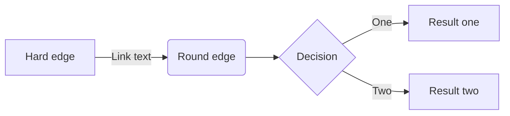

# What are SBOM used for?

A blog to explain how the SBOM data is used, particularly around supply chain tracking, open-source packages and cves.

## SBOM Formats
SBOMs can be generated in variety of formats (for both human and machine-readable format). The primary supported formats are:
- [CycloneDX](https://cyclonedx.org/): a full-stack BOM standard by OWASP community covering SBOM, SaaSBOM, HBOM, OBMOM, VDR, and VEX. [Click here](https://cyclonedx.org/specification/overview/) to learn more about the CycloneDX specification.
- [SPDX](https://spdx.dev/): an open standard for SBOM (ISO/IEC 5962:2021) supported by The Linux Foundation.
- [SWID](https://www.iso.org/standard/65666.html): a standard by the ISO/IEC for tagging software to optimize its identification and management.
- [Syft](https://github.com/anchore/syft): a CLI tool by [Anchore](https://anchore.com/) (written in Go) for generating SBOM from container images.

## Information in SBOM
While SBOM generates comprehensive information, these are the minimal viable information required:
- Supplier Name
- Component Name
- Unique Identifier for the component
- Version
- Component Hash
- Relationship
- Author/Creator
- License Information

## SBOM Usage
These are primary areas where SBOM usage has increased in recent times:

### Insights for open source licensing and compliance
- With increasing usage of open source and third-party software in building solutions across industries, SBOM is becoming a mandate for full disclousre.
- Identify End-of-life (EOL) products and mitigate associated risks proactively.
- Comply with licensing obligations in a transparent way.

Here is a reference lifecycle for end-to-end processing enabled using SBOM:

### Detect, prioritize and mitigate security vulenerabilties
- Identity potentially vulenerable componens and automate the detection process.
- Alert about potential security risks based on the version information available in the SBOM.

### Reduce operational risk and mitigate proactively
- With SBOM data bundled with every product version release, it ensures any operational risk is mitigated automatically.

## References
- [CycloneDX Object Model and Specification Overview](https://cyclonedx.org/specification/overview/)
- [The National Telecommunications and Information Administration (NTIA) Document on SBOM Roles and Benefits](https://www.ntia.gov/files/ntia/publications/ntia_sbom_use_cases_roles_benefits-nov2019.pdf)

## Useful Tools
- [Online SBOM Generation for Demo](https://democert.org/sbom/)
- [Paketo Build Pack for SBOM Generation](https://paketo.io/docs/howto/sbom/)
- [CycloneDX Tool Center for SBOM Ecosystem](https://cyclonedx.org/tool-center/)
- [SPDX Online Tool for SBOM Validate, Compare](https://tools.spdx.org/app/)
- [CVE Online Search Utility](https://cve.mitre.org/cve/search_cve_list.html)

## Acronyms Used

| Acronym | Description |
|---------|-------------|
| CVE     | Common Vulnerabilities and Exposures |
| HBOM    | Hardware bills of materials: every physical piece or component used to build a product |
| OWASP   | The Open Web Application Security Project |
| SBOM    | Software Bill of Materials |
| SCA     | Software Composition Analysis |
| VEX     | Vulnerability-Exploitability eXchange: an attestation, a form of a security advisory that indicates whether a product or products are affected by a known vulnerability or vulnerabilities |